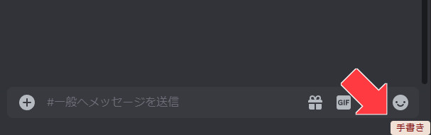
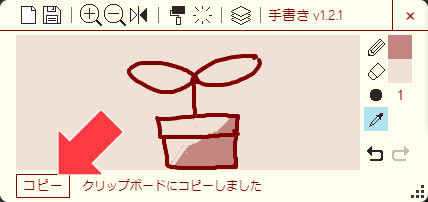
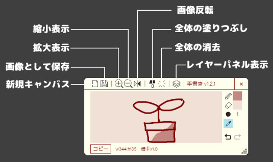
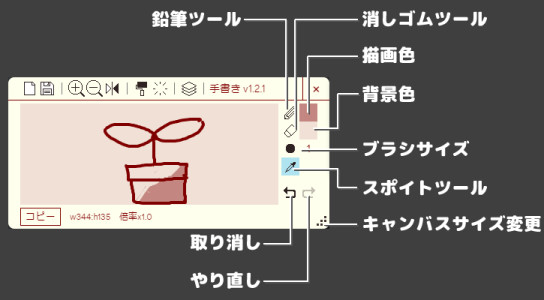
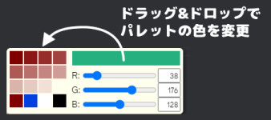

# ブラウザ拡張機能 DiscoTegaki

Discord上に、生まれたばかりの掲示板っぽく使えるお絵かき機能を追加します。
Google Chrome, Edgeで動作確認済み。

- Chrome ウェブストア
  - https://chromewebstore.google.com/detail/discotegaki/eiaogpnffnhfkddeenblefkjbijlflhd

- Webアプリ版
  - https://toshiakidisco.github.io/discord-tegaki/

不具合修正・機能追加が発生した場合、ストアへの反映には時間がかかるため、先行してGitHubリポジトリのリリースに公開していきます。
 (野良アプリとしてのインストールになります。ご了承ください。)

## 使い方
インストールすると、Discordの画面の右下に「手書き」ボタンが表示されるので、クリックするとお絵かきできるウィンドウが表示されます。



自由にお絵かきしたあとは「コピー」ボタンでクリップボードにコピーができるので、そのまま投稿欄にペーストすることが可能です。



### ショートカット
- Ctrl + Z: 取り消し
- Ctrl + Y: やり直し
- Ctrl + C: クリップボードにコピー
- N: 鉛筆ツール (長押しで一時切替)
- E: 消しゴムツール (長押しで一時切替)
- Alt: スポイトツール (一時切替)

### アイコンの説明

#### タイトル部分


#### サイド部分


#### 色選択パネル


#### レイヤーパネル


## ビルド
要 Node.js + npm
```
$ npm install
$ npm run build
```

## リリースノート
v1.3.0
- バケツツールの追加
- 自動保存機能の追加
  - お絵かきをしている間5分ごと&お絵かきした後にページを閉じた時に保存されます
  - 保存された内容は次回キャンバスを開いた時に自動的に復元されます
  - 絵のコピー・手動での保存を行うと自動保存の内容は消去されます
  - お絵かきしていない間は作動しないので無駄な負荷をかけません

v1.2.1
- レイヤー表示/非表示対応
- レイヤー透明度対応
- パレットの色変更が拡張機能版で動作しなかったのを修正

v1.2.0
- レイヤー機能の追加
  - それに伴いツールの挙動変更
  - 消しゴムツールは透明色での上書きに
  - サブカラーを変更すると下地の色が変化
  - スポイトは常にメインカラーに反映
- 簡易的な手ブレ補正の追加
- 取り消しの履歴数を10件から20件に増加
- 色のプレビューをパレットにドラッグ&ドロップでパレットの色を変更できるように
- ストローク中にキーの長押しを解除した際の挙動修正
- 他、いろいろ最適化等

v1.1.1
- Webアプリ版公開
- キャンバス拡大・縮小時の挙動変化 (中心を維持 → 左上を維持)

v1.1.0
- カラーパレットの追加
- スポイト機能の追加
- カーソルのエクスペリエンスの改善
  - 暗い所では白 明るいところでは黒で表示
  - ブラシサイズが大きい場合 それに合わせた円形で表示
- 鉛筆と消しゴムのサイズの独立
- ショートカットの追加 Alt:スポイト Ctrl + C:クリップボードコピー
- 鉛筆(N) 消しゴム(E)のショートカットを長押しした場合、押している間だけツールが切り替わるように。
- 取り消し・やり直しができない場合はアイコンをグレーに表示
- 他、細かい修正

v1.0.1
- クリップボードコピー時のファイル名にタイムスタンプを付与。
- タイトル部分をドラッグでウィンドウを移動できるように。
- 右下部分をドラッグでキャンバスサイズを変えられるように
- ツールの追加: 新規キャンバス, 保存, 左右反転, 取り消し, やり直し
- ショートカットの追加 N: 鉛筆ツール, E: 消しゴムツール
- Discordトップページなどにも表示されてしまっていたのを修正
- 拡大しすぎて画面外にいってしまうのを修正
- 他、細かい修正
